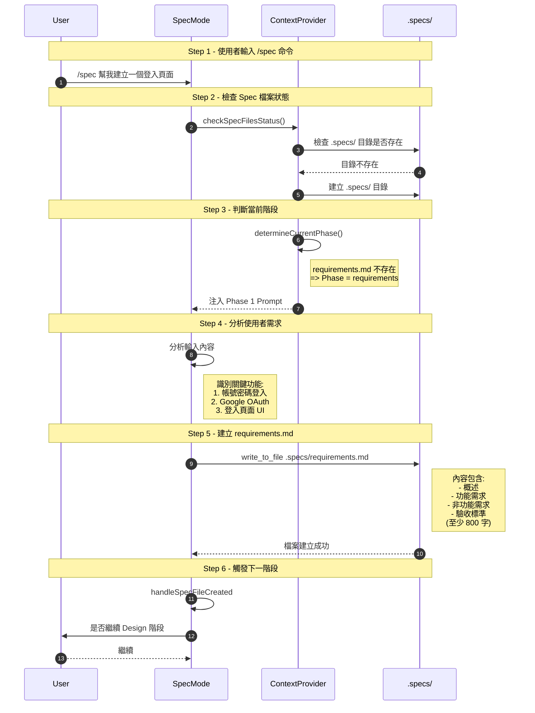
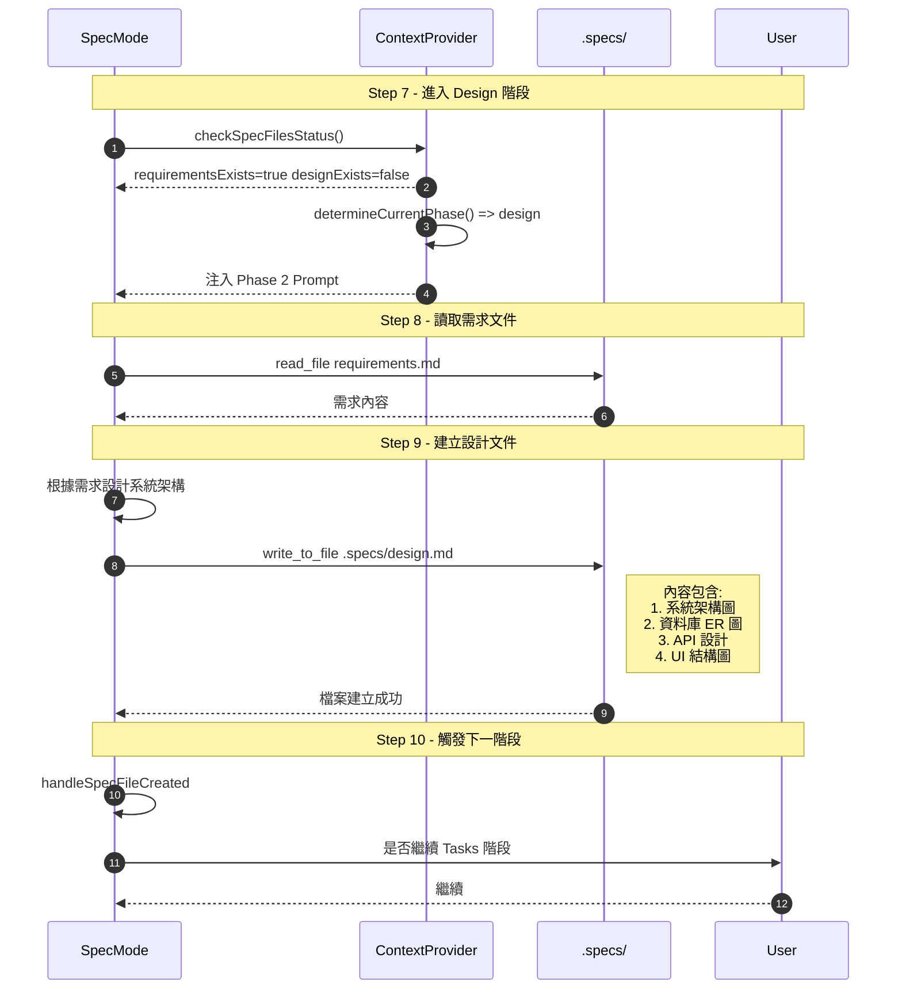
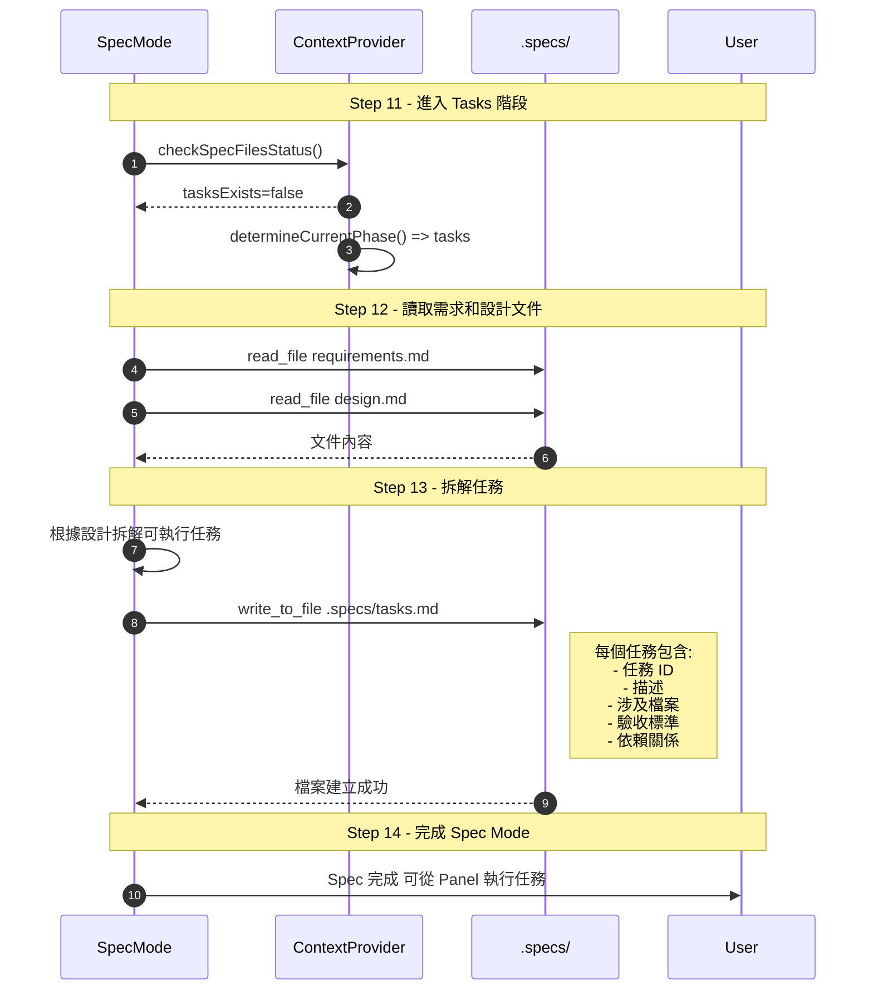
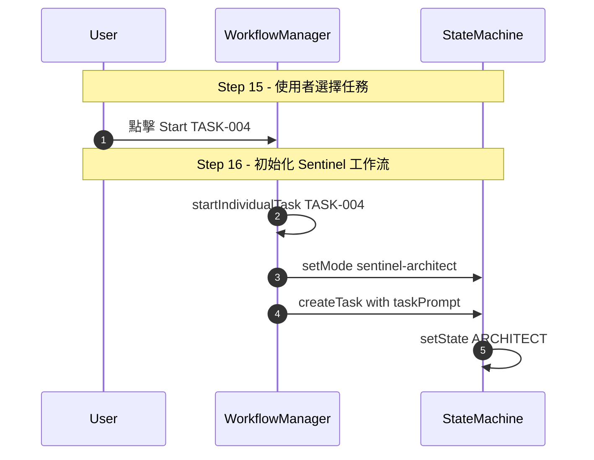
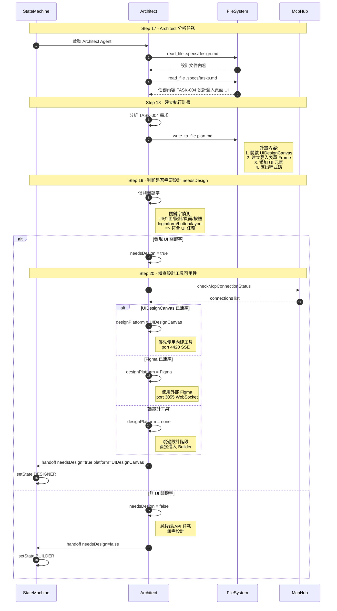
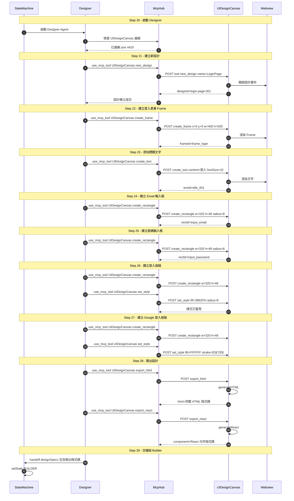
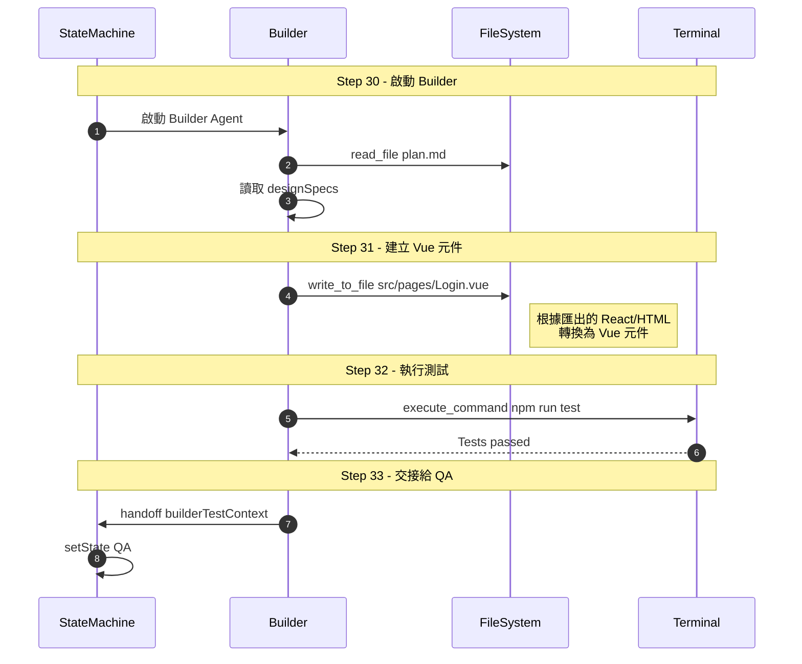
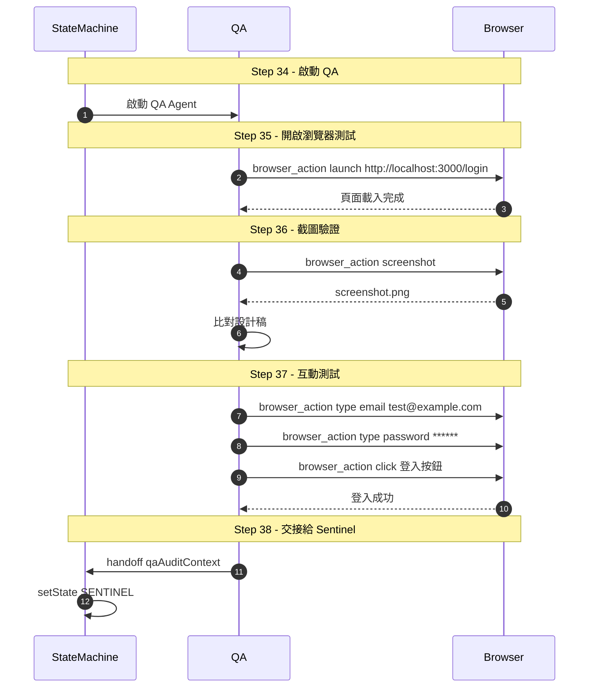
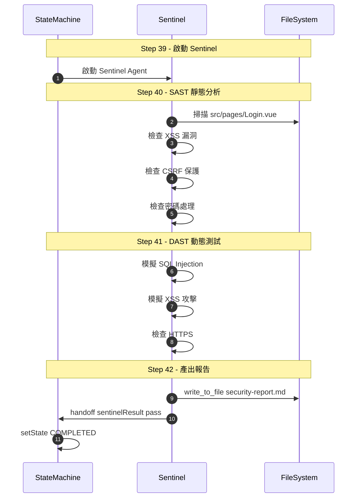
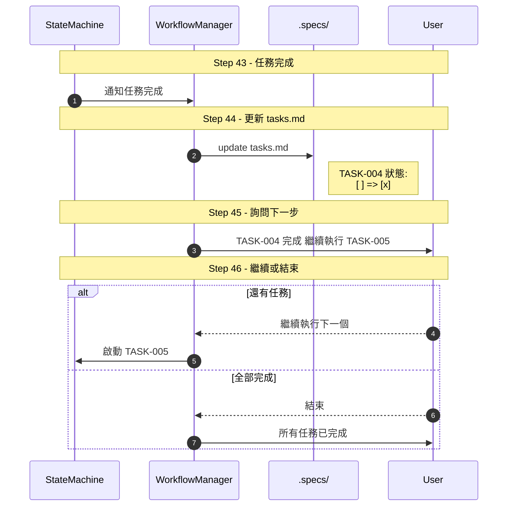

# Roo Code 完整工作流程範例

> 範例：「幫我建立一個登入頁面」
> 從 Spec Mode 開始到完成的每個步驟詳解

---

## 🎯 使用者輸入

```
/spec 幫我建立一個登入頁面，需要帳號密碼登入和 Google OAuth
```

---

## 📋 Phase 1: Requirements（需求收集）



### 📄 產出檔案：`.specs/requirements.md`

```markdown
# 登入頁面需求規格

## 1. 概述

建立一個現代化的登入頁面，支援傳統帳號密碼登入及 Google OAuth 社交登入...

## 2. 功能需求

### 2.1 帳號密碼登入

- 使用者可輸入 Email 和密碼
- 密碼欄位需有顯示/隱藏切換
- 提供「記住我」選項
- 提供「忘記密碼」連結

### 2.2 Google OAuth 登入

- 一鍵 Google 登入按鈕
- 自動取得 Google 用戶資料
- 首次登入自動建立帳號

## 3. 非功能需求

- 響應式設計（支援手機、平板、桌機）
- 頁面載入時間 < 2 秒
- 支援 HTTPS
- 符合 WCAG 2.1 無障礙標準

## 4. 驗收標準

- [ ] 可成功以帳號密碼登入
- [ ] 可成功以 Google OAuth 登入
- [ ] 錯誤訊息正確顯示
- [ ] 響應式設計正常運作
```

---

## 🎨 Phase 2: Design（系統設計）



### 📄 產出檔案：`.specs/design.md`

```markdown
# 登入頁面系統設計

## 1. 系統架構

graph TB
Client[Login Page] --> API[API Gateway]
API --> Auth[Auth Service]
Auth --> DB[(PostgreSQL)]
Auth --> Google[Google OAuth]

## 2. 資料庫設計

| 欄位          | 型態         | 說明      |
| ------------- | ------------ | --------- |
| id            | BIGINT       | 主鍵      |
| email         | VARCHAR(255) | 信箱      |
| password_hash | VARCHAR(255) | 密碼雜湊  |
| google_id     | VARCHAR(255) | Google ID |
| created_at    | TIMESTAMP    | 建立時間  |

## 3. API 設計

| Method | Endpoint         | 說明         |
| ------ | ---------------- | ------------ |
| POST   | /api/auth/login  | 帳號密碼登入 |
| POST   | /api/auth/google | Google OAuth |
| GET    | /api/auth/me     | 取得當前用戶 |

## 4. UI 結構

- 登入表單區塊
  - Email 輸入框
  - 密碼輸入框
  - 記住我勾選框
  - 登入按鈕
- 社交登入區塊
  - Google 登入按鈕
- 輔助連結區塊
  - 忘記密碼
  - 註冊帳號
```

---

## ✅ Phase 3: Tasks（任務拆解）



### 📄 產出檔案：`.specs/tasks.md`

```markdown
# 登入頁面任務清單

## TASK-001: 建立專案架構 (low)

**描述:** 初始化 Vue 3 + Vite 專案
**涉及檔案:** package.json, vite.config.ts, tsconfig.json
**驗收標準:**

- [ ] npm run dev 可正常執行
- [ ] TypeScript 設定正確
      **依賴:** 無

## TASK-002: 建立資料庫結構 (medium)

**描述:** 建立 users 資料表和 migrations
**涉及檔案:** migrations/create_users_table.ts
**驗收標準:**

- [ ] Migration 可正常執行
- [ ] 資料表結構符合設計
      **依賴:** TASK-001

## TASK-003: 實作 Auth API (high)

**描述:** 實作登入和 Google OAuth API
**涉及檔案:** src/api/auth.ts, src/controllers/AuthController.ts
**驗收標準:**

- [ ] POST /api/auth/login 可正常運作
- [ ] POST /api/auth/google 可正常運作
      **依賴:** TASK-002

## TASK-004: 設計登入頁面 UI (medium)

**描述:** 使用 UIDesignCanvas 設計登入頁面
**涉及檔案:** Figma/UIDesignCanvas 設計稿
**驗收標準:**

- [ ] UI 設計符合需求
- [ ] 可匯出 HTML/React 程式碼
      **依賴:** 無

## TASK-005: 實作登入頁面前端 (high)

**描述:** 根據設計稿實作 Vue 元件
**涉及檔案:** src/pages/Login.vue, src/components/GoogleLoginButton.vue
**驗收標準:**

- [ ] UI 符合設計稿
- [ ] 表單驗證正常
      **依賴:** TASK-003, TASK-004
```

---

## 🚀 Phase 4: Execution（執行任務）

### Step 15-16: 選擇並啟動任務



---

## 🟦 Architect Phase（含設計判斷邏輯）



---

## 🎨 Designer Phase（使用 UIDesignCanvas）



---

## 🟩 Builder Phase



---

## 🟨 QA Phase



---

## 🟥 Sentinel Phase



---

## ✅ 完成並更新 Spec



---

## 📊 流程總覽

| Phase        | Steps | 主要產出               |
| ------------ | ----- | ---------------------- |
| Requirements | 1-6   | .specs/requirements.md |
| Design       | 7-10  | .specs/design.md       |
| Tasks        | 11-14 | .specs/tasks.md        |
| Execution    | 15-16 | 啟動 Sentinel 工作流   |
| Architect    | 17-19 | plan.md                |
| Designer     | 20-29 | UI 設計 + 匯出程式碼   |
| Builder      | 30-33 | 程式碼實作             |
| QA           | 34-38 | 測試報告               |
| Sentinel     | 39-42 | 安全報告               |
| Complete     | 43-46 | 更新 tasks.md          |

**總步驟數：46 步**
