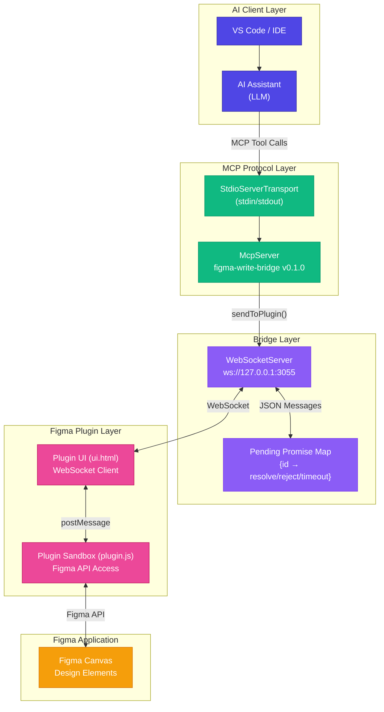
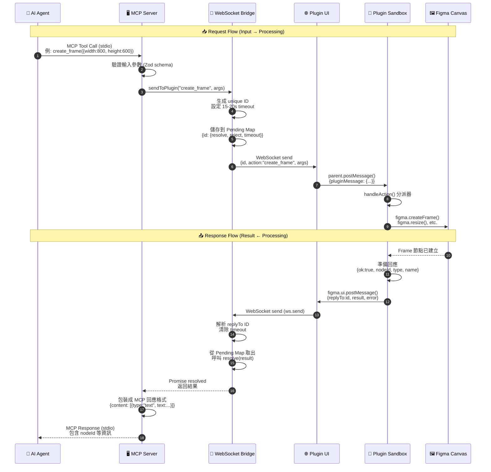
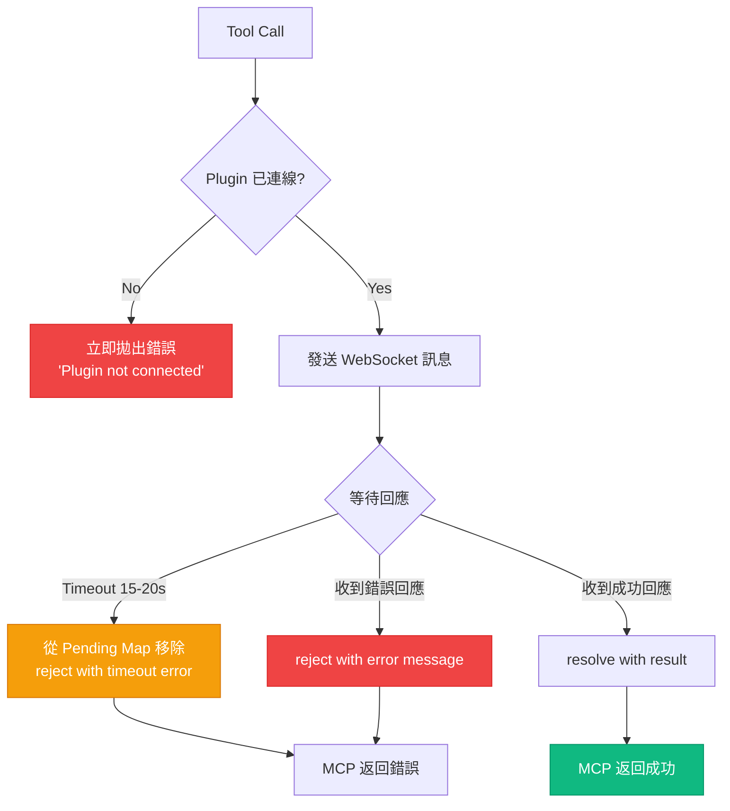
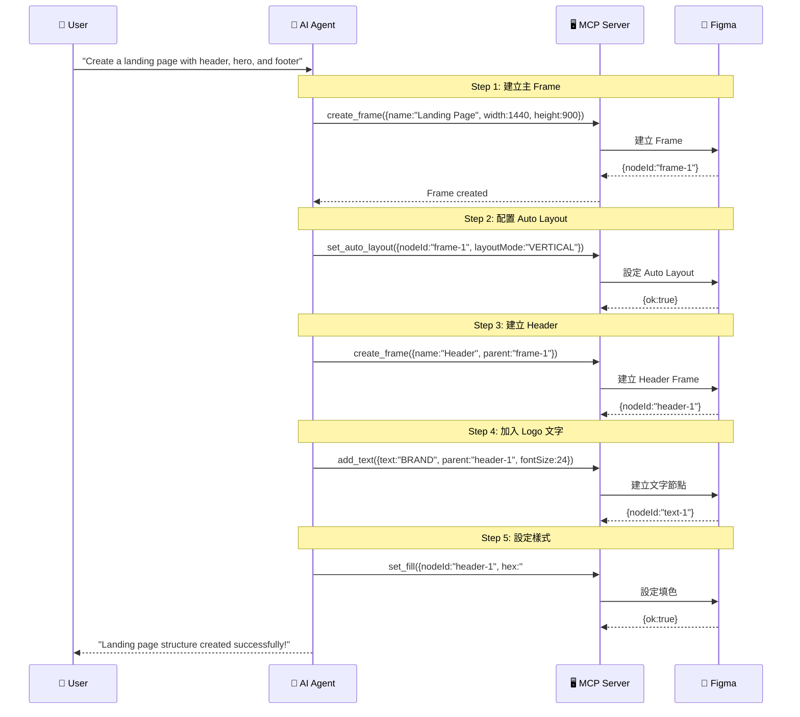
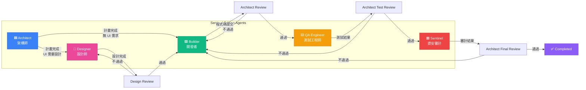
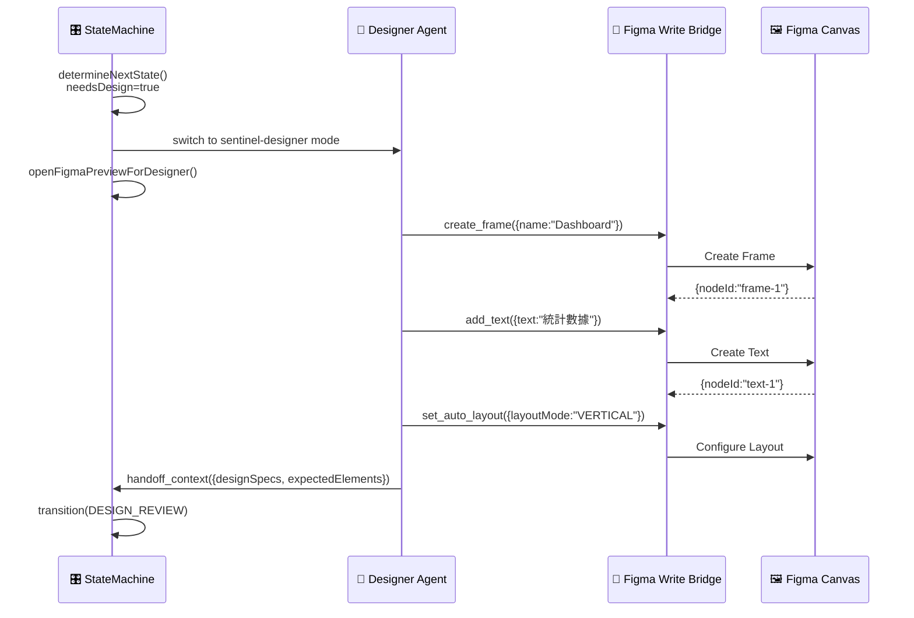
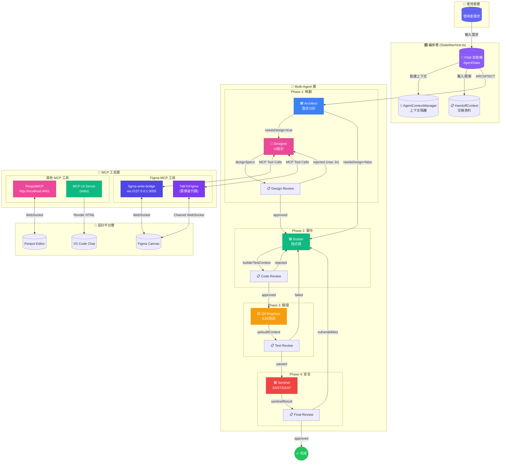
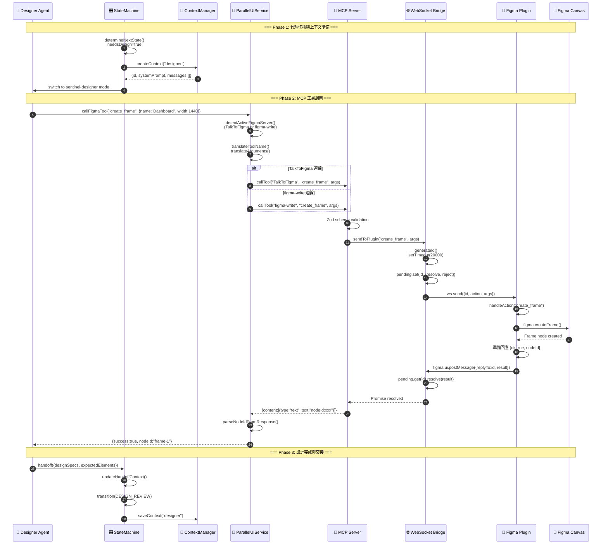
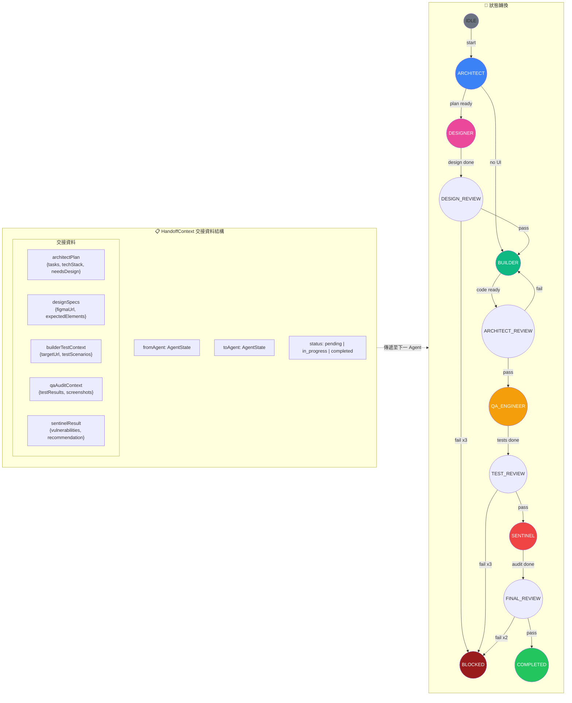

# Figma Write Bridge 模組完整技術文檔

> **模組版本**: v0.1.0  
> **所屬專案**: Roo Code (AI-Powered Dev Team)  
> **文檔更新日期**: 2026-01-29

---

## 📋 目錄

1. [概述](#概述)
2. [系統架構圖](#系統架構圖)
3. [資料流程圖](#資料流程圖)
4. [元件詳細說明](#元件詳細說明)
5. [工具清單](#工具清單)
6. [序列圖](#序列圖)
7. [部署與配置](#部署與配置)

---

## 概述

**Figma Write Bridge** 是一個 Model Context Protocol (MCP) 伺服器，讓 AI 編碼代理能夠透過 WebSocket 橋接器和 Figma 插件，以程式化方式操作 Figma 設計文件。

### 核心價值

- 🤖 **AI 驅動設計**: 讓 AI Agent 直接創建和修改 Figma 設計
- 🔌 **MCP 標準協議**: 使用 Model Context Protocol 確保與各種 AI 客戶端相容
- 🌐 **即時雙向通訊**: 透過 WebSocket 實現低延遲的雙向溝通
- 🎨 **完整 Figma API 支援**: 40+ 個設計工具涵蓋所有常用操作

---

## 系統架構圖



### 架構分層說明

| 層級             | 元件                             | 職責                    |
| ---------------- | -------------------------------- | ----------------------- |
| **AI Client**    | VS Code + AI Assistant           | 發起設計操作請求        |
| **MCP Protocol** | StdioServerTransport + McpServer | 標準化工具呼叫協議      |
| **Bridge**       | WebSocketServer + Pending Map    | 跨進程通訊與請求追蹤    |
| **Figma Plugin** | ui.html + plugin.js              | 在 Figma 沙盒中執行 API |
| **Figma App**    | Canvas                           | 設計元素的最終呈現      |

---

## 資料流程圖

### 完整請求-回應流程



### 錯誤處理流程



---

## 元件詳細說明

### 1. MCP Server ([figma-write-bridge.ts](file:///Users/vito/Documents/GitHub/agentic%20AI%20agent/tools/figma-write-bridge/figma-write-bridge.ts) / [server.ts](file:///Users/vito/Documents/GitHub/agentic%20AI%20agent/src/tools/mcp-ui-server/server.ts))

**職責**: 作為 MCP 協議的入口點，定義和註冊所有可用工具

```typescript
// 核心結構
const server = new McpServer({
  name: "figma-write-bridge",
  version: "1.0.0",
});

// 工具註冊範例
server.registerTool(
  "create_frame",
  {
    description: "Create a frame on the current page.",
    inputSchema: {
      name: z.string().optional(),
      width: z.number().positive(),
      height: z.number().positive(),
      // ...
    },
  },
  async (input) => ok(await sendToPlugin("create_frame", input)),
);
```

**關鍵功能**:

- 透過 `StdioServerTransport` 處理 stdin/stdout 通訊
- 使用 Zod schema 驗證輸入參數
- 將工具呼叫轉發到 WebSocket Bridge

---

### 2. WebSocket Bridge

**職責**: 建立 MCP Server 與 Figma Plugin 之間的雙向通訊

```typescript
// 配置
const HOST = "127.0.0.1";
const PORT = 3055;
const wss = new WebSocketServer({ host: HOST, port: PORT });

// Promise-based RPC 機制
function sendToPlugin(action: string, args: unknown): Promise<any> {
  const id = makeId(); // 生成唯一 ID
  pluginClient.send(JSON.stringify({ id, action, args }));

  return new Promise((resolve, reject) => {
    const timeout = setTimeout(() => {
      pending.delete(id);
      reject(new Error(`Plugin timeout for "${action}".`));
    }, 20000); // 20 秒超時

    pending.set(id, { resolve, reject, timeout });
  });
}
```

**Pending Map 結構**:

```typescript
type Pending = {
  resolve: (value: any) => void;
  reject: (reason?: any) => void;
  timeout: NodeJS.Timeout;
};
const pending = new Map<string, Pending>();
```

---

### 3. Plugin UI ([ui.html](file:///Users/vito/Documents/GitHub/agentic%20AI%20agent/tools/figma-write-bridge/plugin/ui.html))

**職責**: 作為 WebSocket 與 Figma Sandbox 之間的橋樑

```html
<script>
  let ws;
  function connect() {
    ws = new WebSocket("ws://127.0.0.1:3055");

    // 接收 WebSocket 訊息 → 轉發到 Plugin Sandbox
    ws.onmessage = (ev) => {
      const msg = JSON.parse(ev.data);
      parent.postMessage({ pluginMessage: msg }, "*");
    };

    // 自動重連機制
    ws.onclose = () => setTimeout(connect, 1000);
  }

  // 接收 Plugin Sandbox 訊息 → 轉發到 WebSocket
  onmessage = (ev) => {
    if (ev.data?.pluginMessage && ws?.readyState === 1) {
      ws.send(JSON.stringify(ev.data.pluginMessage));
    }
  };

  connect();
</script>
```

---

### 4. Plugin Sandbox ([plugin.js](file:///Users/vito/Documents/GitHub/agentic%20AI%20agent/tools/figma-write-bridge/plugin/plugin.js))

**職責**: 在 Figma 沙盒環境中執行實際的設計操作

```javascript
// 初始化 (隱藏 UI 以使用 WebSocket)
figma.showUI(__html__, { visible: false });

// 訊息處理
figma.ui.onmessage = async (msg) => {
  const { id, action, args } = msg || {};
  try {
    const result = await handleAction(action, args || {});
    reply(id, Object.assign({ ok: true }, result || {}));
  } catch (e) {
    reply(id, { ok: false }, e.message);
  }
};

// Action 分派器
async function handleAction(action, input) {
  switch (action) {
    case "create_frame":
      return createFrame(input);
    case "create_rectangle":
      return createRectangle(input);
    case "add_text":
      return addText(input);
    // ... 40+ 個 actions
    default:
      throw new Error("Unknown action: " + action);
  }
}
```

---

## 工具清單

### 🎨 創建工具 (Creation)

| 工具名稱             | 描述             | 必要參數                    |
| -------------------- | ---------------- | --------------------------- |
| `create_frame`       | 建立 Frame       | `width`, `height`           |
| `create_rectangle`   | 建立矩形         | `width`, `height`           |
| `create_ellipse`     | 建立橢圓         | `width`, `height`           |
| `create_line`        | 建立線條         | `length`                    |
| `create_polygon`     | 建立多邊形       | `sides`, `width`, `height`  |
| `create_star`        | 建立星形         | `points`, `width`, `height` |
| `add_text`           | 建立文字         | [text](file:///Users/vito/Documents/GitHub/agentic%20AI%20agent/src/services/figma/AgentContextManager.ts#141-147)                      |
| `place_image_base64` | 放置 Base64 圖片 | `width`, `height`, [base64](file:///Users/vito/Documents/GitHub/agentic%20AI%20agent/tools/figma-write-bridge/plugin/plugin.js#33-40) |

### 🔍 選擇工具 (Selection)

| 工具名稱           | 描述         | 必要參數  |
| ------------------ | ------------ | --------- |
| `find_nodes`       | 搜尋節點     | -         |
| `select_nodes`     | 選擇節點     | `nodeIds` |
| `get_selection`    | 取得目前選擇 | -         |
| `create_page`      | 建立頁面     | -         |
| `set_current_page` | 切換頁面     | `pageId`  |

### 📐 節點管理 (Node Management)

| 工具名稱         | 描述     | 必要參數                    |
| ---------------- | -------- | --------------------------- |
| `rename_node`    | 重新命名 | `nodeId`, [name](file:///Users/vito/Documents/GitHub/agentic%20AI%20agent/tools/figma-write-bridge/plugin/plugin.js#215-217)            |
| `delete_node`    | 刪除節點 | `nodeId`                    |
| `duplicate_node` | 複製節點 | `nodeId`                    |
| `resize_node`    | 調整大小 | `nodeId`, `width`, `height` |
| `rotate_node`    | 旋轉     | `nodeId`, `rotation`        |
| `set_position`   | 設定位置 | `nodeId`, `x`, `y`          |
| `group_nodes`    | 群組     | `nodeIds`                   |
| [ungroup](file:///Users/vito/Documents/GitHub/agentic%20AI%20agent/tools/figma-write-bridge/plugin/plugin.js#234-244)        | 解散群組 | `groupId`                   |

### 🎨 樣式工具 (Styling)

| 工具名稱            | 描述         | 必要參數            |
| ------------------- | ------------ | ------------------- |
| `set_fill`          | 設定填色     | `nodeId`, [hex](file:///Users/vito/Documents/GitHub/agentic%20AI%20agent/tools/figma-write-bridge/plugin/plugin.js#19-25)     |
| `set_stroke`        | 設定邊框     | `nodeId`, [hex](file:///Users/vito/Documents/GitHub/agentic%20AI%20agent/tools/figma-write-bridge/plugin/plugin.js#19-25)     |
| `set_corner_radius` | 設定圓角     | `nodeId`            |
| `set_opacity`       | 設定透明度   | `nodeId`, `opacity` |
| `set_blend_mode`    | 設定混合模式 | `nodeId`, `mode`    |
| `add_effect`        | 新增效果     | `nodeId`, `type`    |
| `clear_effects`     | 清除效果     | `nodeId`            |

### 📏 佈局工具 (Layout)

| 工具名稱            | 描述             | 必要參數 |
| ------------------- | ---------------- | -------- |
| `set_auto_layout`   | 設定 Auto Layout | `nodeId` |
| `set_constraints`   | 設定約束         | `nodeId` |
| `layout_grid_add`   | 新增佈局格線     | `nodeId` |
| `layout_grid_clear` | 清除佈局格線     | `nodeId` |

### ✏️ 文字工具 (Text)

| 工具名稱           | 描述         | 必要參數         |
| ------------------ | ------------ | ---------------- |
| `set_text_content` | 設定文字內容 | `nodeId`, [text](file:///Users/vito/Documents/GitHub/agentic%20AI%20agent/src/services/figma/AgentContextManager.ts#141-147) |
| `set_text_style`   | 設定文字樣式 | `nodeId`         |
| `set_text_color`   | 設定文字顏色 | `nodeId`, [hex](file:///Users/vito/Documents/GitHub/agentic%20AI%20agent/tools/figma-write-bridge/plugin/plugin.js#19-25)  |

### 🧩 元件工具 (Components)

| 工具名稱           | 描述     | 必要參數        |
| ------------------ | -------- | --------------- |
| `create_component` | 建立元件 | -               |
| `create_instance`  | 建立實例 | `componentId`   |
| `detach_instance`  | 分離實例 | `nodeId`        |
| `boolean_op`       | 布林運算 | [op](file:///Users/vito/Documents/GitHub/agentic%20AI%20agent/tools/figma-write-bridge/plugin/ui.html#7-11), `nodeIds` |

### 📤 匯出工具 (Export)

| 工具名稱          | 描述         | 必要參數                 |
| ----------------- | ------------ | ------------------------ |
| `export_node`     | 匯出節點     | `nodeId`                 |
| `set_plugin_data` | 設定插件資料 | `nodeId`, `key`, `value` |
| `get_plugin_data` | 取得插件資料 | `nodeId`, `key`          |
| `set_properties`  | 批次設定屬性 | `nodeId`, `props`        |
| `get_file_url`    | 取得檔案 URL | -                        |

---

## 序列圖

### 典型使用場景：建立 Landing Page



---

## 部署與配置

### 前置需求

- Node.js 18+
- Figma Desktop App 或 Browser
- MCP-compatible AI Client (VS Code, Cursor, etc.)

### 安裝步驟

```bash
# 1. 安裝依賴
cd tools/figma-write-bridge
npm install

# 2. 啟動 MCP Server
npm start
# 輸出: [bridge] Waiting for plugin on ws://127.0.0.1:3055

# 3. 在 Figma 中載入插件
# Plugins → Development → Import plugin from manifest
# 選擇 plugin/manifest.json
```

### MCP Client 配置

```json
{
  "mcpServers": {
    "figma-write": {
      "command": "node",
      "args": ["--loader", "tsx", "/path/to/figma-write-bridge/server.ts"]
    }
  }
}
```

### 環境變數

| 變數    | 預設值      | 描述               |
| ------- | ----------- | ------------------ |
| `HOST`  | `127.0.0.1` | WebSocket 綁定地址 |
| `PORT`  | `3055`      | WebSocket 埠號     |
| Timeout | `15-20s`    | 操作超時時間       |

---

## 限制與注意事項

> [!WARNING]
> **單一連線限制**: 同時只能有一個 Figma Plugin 實例連線

> [!IMPORTANT]
> **超時設定**: 操作必須在 15-20 秒內完成

> [!NOTE]
> **網路存取**: Plugin 需要在 Figma 設定中允許網路存取

---

## 與其他設計工具的對比

本專案 `tools/` 目錄下還包含 **Penpot MCP** 模組，採用類似架構。此外，系統還整合了外部 **TalkToFigma** MCP 伺服器：

### Figma MCP 工具比較

| 功能     | Figma Write Bridge (內建) | TalkToFigma (外部)  | Penpot MCP       |
| -------- | ------------------------- | ------------------- | ---------------- |
| 協議     | MCP over stdio            | MCP over stdio      | MCP over SSE     |
| 橋接     | WebSocket (3055)          | WebSocket           | WebSocket (4402) |
| 運行環境 | Figma Plugin Sandbox      | Cursor Figma Plugin | Penpot Plugin    |
| 開源     | 依賴 Figma                | 依賴 Figma          | 完全開源         |
| 頻道連線 | 自動                      | 需輸入頻道代碼      | WebSocket 自動   |

### TalkToFigma (ai-figma-mcp)

**TalkToFigma** 是外部 MCP 伺服器，需要使用 Cursor Figma Plugin 並輸入頻道代碼連線。

#### 可用工具

| 類別         | 工具                                                                |
| ------------ | ------------------------------------------------------------------- |
| **文件操作** | `get_document_info`, `get_selection`, `get_node_info`               |
| **創建**     | `create_frame`, `create_rectangle`, `create_text`, `create_ellipse` |
| **樣式**     | `set_fill_color`, `set_corner_radius`, `set_stroke`                 |
| **佈局**     | `move_node`, `resize_node`, `set_auto_layout`                       |
| **元件**     | `get_local_components`, `create_component_instance`                 |
| **匯出**     | `export_node_as_image`, `get_styles`                                |

#### 頻道連線機制

```typescript
// McpHub.ts 中的頻道連線邏輯
async promptTalkToFigmaChannelConnection(forcePrompt: boolean = false) {
  const channelCode = await vscode.window.showInputBox({
    prompt: "請輸入 Figma 頻道代碼 (Enter Figma channel code from plugin)",
    placeHolder: "e.g., abc123"
  });

  // 呼叫 join_channel 工具連線
  await this.callTool("TalkToFigma", "join_channel", { channel: channelCode });
}
```

#### 參數映射

系統透過 `ParallelUIService` 自動處理兩種 Figma MCP 的參數差異：

```typescript
// figma-write → TalkToFigma 參數轉換
const TOOL_NAME_MAPPING = {
  add_text: "create_text", // figma-write → TalkToFigma
  set_text_color: "set_fill_color", // 同一工具不同名稱
};

// 顏色參數轉換：hex → RGB object
// figma-write: { hex: "#FF0000" }
// TalkToFigma: { color: { r: 1, g: 0, b: 0 } }
```

---

---

## Multi-Agent 架構設計 (Sentinel Edition)

Figma Write Bridge 整合於 **Roo Code Sentinel Edition**，這是一個完整的 Multi-Agent 開發工作流系統。

### 代理人 (Agents) 概覽



### 代理人角色定義

| Agent              | 職責                               | 輸入           | 輸出                         |
| ------------------ | ---------------------------------- | -------------- | ---------------------------- |
| **🟦 Architect**   | 需求分析、任務拆解、技術決策       | 使用者需求     | `architectPlan` JSON         |
| **🎨 Designer**    | UI/UX 設計 (使用 Figma/Penpot MCP) | 設計規格       | Figma 設計稿、`designSpecs`  |
| **🟩 Builder**     | 程式碼實作、單元測試               | 架構計畫       | 程式碼、`builderTestContext` |
| **🟨 QA Engineer** | E2E 測試、視覺驗證                 | 測試環境資訊   | `qaAuditContext`             |
| **🟥 Sentinel**    | SAST/DAST 安全審計                 | 程式碼、入口點 | `sentinelResult`             |

---

### 狀態機流程圖 (Finite State Machine)

```mermaid
stateDiagram-v2
    [*] --> IDLE
    IDLE --> ARCHITECT: start()

    state "Phase 1: Planning" as P1 {
        ARCHITECT --> DESIGNER: needsDesign=true
        ARCHITECT --> BUILDER: needsDesign=false
        DESIGNER --> DESIGN_REVIEW: designSpecs
        DESIGN_REVIEW --> DESIGNER: rejected (max 3x)
        DESIGN_REVIEW --> BUILDER: approved
    }

    state "Phase 2: Implementation" as P2 {
        BUILDER --> ARCHITECT_REVIEW_CODE: builderTestContext
        ARCHITECT_REVIEW_CODE --> BUILDER: rejected
        ARCHITECT_REVIEW_CODE --> QA_ENGINEER: approved
    }

    state "Phase 3: Testing" as P3 {
        QA_ENGINEER --> ARCHITECT_REVIEW_TESTS: qaAuditContext
        ARCHITECT_REVIEW_TESTS --> BUILDER: tests failed
        ARCHITECT_REVIEW_TESTS --> SENTINEL: tests passed
    }

    state "Phase 4: Security" as P4 {
        SENTINEL --> ARCHITECT_REVIEW_FINAL: sentinelResult
        ARCHITECT_REVIEW_FINAL --> BUILDER: vulnerabilities
        ARCHITECT_REVIEW_FINAL --> COMPLETED: approved
    }

    COMPLETED --> [*]

    note right of BLOCKED
        Max retries exceeded:
        - QA: 3 次
        - Security: 2 次
        需要人工介入
    end note
```

---

### 上下文交接 (Handoff Context)

代理人之間透過 `HandoffContext` 物件傳遞資訊：

```typescript
interface HandoffContext {
  fromAgent: AgentState; // 來源代理
  toAgent: AgentState; // 目標代理
  status: "pending" | "in_progress" | "completed";

  // Phase 1: Architect
  architectPlan?: {
    projectName: string;
    tasks: Task[];
    techStack: { frontend: string[]; backend: string[] };
    needsDesign?: boolean; // 是否需要 UI 設計
    useFigma?: boolean; // 使用 Figma MCP
  };

  // Phase 1b: Designer (Figma Integration)
  figmaUrl?: string; // Figma 檔案 URL
  designSpecs?: object; // 設計規格
  expectedElements?: string[]; // 預期設計元素清單

  // Phase 2: Builder
  builderTestContext?: {
    targetUrl: string;
    testScenarios: TestScenario[];
    changedFiles: string[];
    runCommand: string;
  };

  // Phase 3: QA
  qaAuditContext?: {
    testsPassed: boolean;
    testResults: TestResult[];
    screenshots: string[];
  };

  // Phase 4: Sentinel
  sentinelResult?: {
    securityPassed: boolean;
    vulnerabilities: Vulnerability[];
    recommendation: "approve" | "fix_required" | "reject";
  };
}
```

---

### Designer Agent 與 Figma Write Bridge 整合

當 Architect 確定需要 UI 設計時，工作流會進入 **Designer** 狀態：



---

### Agent 上下文隔離 (Context Isolation)

[AgentContextManager](file:///Users/vito/Documents/GitHub/agentic%20AI%20agent/src/services/figma/AgentContextManager.ts#66-331) 確保每個代理有獨立的對話歷史：

```typescript
class AgentContextManager {
  private contexts: Map<string, AgentContext> = new Map();

  // 為每個代理創建隔離上下文
  createContext(config: AgentContextConfig): AgentContext {
    const id = `agent-${config.role}-${Date.now()}`;
    return {
      id,
      role: config.role,
      systemPrompt: this.getSystemPrompt(config.role),
      messages: [], // 完全隔離的對話歷史
      metadata: { tokenUsage: { input: 0, output: 0 } },
      state: "idle",
    };
  }

  // 各代理有專屬的 System Prompt
  DEFAULT_SYSTEM_PROMPTS = {
    "ui-button": "You are a UI button designer...",
    "ui-display": "You are a UI display designer...",
    "ui-layout": "You are a UI layout specialist...",
  };
}
```

---

### 循環防護機制

StateMachine 包含多層循環防護：

| 防護類型               | 最大重試次數 | 觸發條件                |
| ---------------------- | ------------ | ----------------------- |
| **QA 重試**            | 3 次         | QA 測試失敗 → Builder   |
| **Security 重試**      | 2 次         | 安全審計失敗 → Builder  |
| **Design Review 重試** | 3 次         | 設計驗證失敗 → Designer |

超過重試次數後，進入 `BLOCKED` 狀態並請求人工介入：

```typescript
if (this.qaRejectionCount >= this.config.maxQARetries) {
  return this.triggerHumanIntervention(
    `QA tests failed ${this.qaRejectionCount} times. Human intervention required.`,
  );
}
```

---

### Multi-Agent + Figma 完整工作流

```
┌─────────────────────────────────────────────────────────────────────┐
│                        👤 User Request                              │
│                "請使用 Figma 設計一個 Dashboard 並實作"             │
└──────────────────────────────────┬──────────────────────────────────┘
                                   │
                                   ▼
┌─────────────────────────────────────────────────────────────────────┐
│  🟦 ARCHITECT - 需求分析                                            │
│  輸出: { needsDesign: true, useFigma: true, tasks: [...] }         │
└──────────────────────────────────┬──────────────────────────────────┘
                                   │ (檢測到 Figma 關鍵字)
                                   ▼
┌─────────────────────────────────────────────────────────────────────┐
│  🎨 DESIGNER - UI 設計                                              │
│  使用: Figma Write Bridge MCP Tools                                 │
│  操作: create_frame, add_text, set_fill, set_auto_layout...       │
│  輸出: { designSpecs: {...}, expectedElements: ["Header",...] }    │
└──────────────────────────────────┬──────────────────────────────────┘
                                   │
                                   ▼
┌─────────────────────────────────────────────────────────────────────┐
│  📋 DESIGN REVIEW - 設計驗證                                        │
│  檢查: 所有 expectedElements 是否都已建立                           │
│  結果: designReviewPassed = true/false                              │
└──────────────────────────────────┬──────────────────────────────────┘
                                   │ (通過)
                                   ▼
┌─────────────────────────────────────────────────────────────────────┐
│  🟩 BUILDER - 程式碼實作                                            │
│  根據 Figma 設計稿實作前端程式碼                                     │
│  輸出: { changedFiles: [...], testScenarios: [...] }               │
└──────────────────────────────────┬──────────────────────────────────┘
                                   │
                                   ▼
┌─────────────────────────────────────────────────────────────────────┐
│  🟨 QA ENGINEER - E2E 測試                                          │
│  使用 browser_action 進行視覺驗證                                   │
│  對照 Figma 設計稿檢查 UI 一致性                                     │
└──────────────────────────────────┬──────────────────────────────────┘
                                   │
                                   ▼
┌─────────────────────────────────────────────────────────────────────┐
│  🟥 SENTINEL - 安全審計                                             │
│  SAST: 靜態程式碼分析 (XSS, SQLi, etc.)                            │
│  DAST: 動態攻擊測試                                                  │
└──────────────────────────────────┬──────────────────────────────────┘
                                   │
                                   ▼
┌─────────────────────────────────────────────────────────────────────┐
│  ✅ COMPLETED - 工作流完成                                          │
│  生成 walkthrough.md 總結報告                                       │
└─────────────────────────────────────────────────────────────────────┘
```

---

## 二、Penpot MCP

**Penpot MCP** 是針對開源設計平台 [Penpot](https://penpot.app) 的 MCP 伺服器。

### 架構

| 元件             | 連接埠           | 用途           |
| ---------------- | ---------------- | -------------- |
| HTTP/SSE Server  | `localhost:4401` | MCP 客戶端連線 |
| WebSocket Server | `localhost:4402` | Plugin 連線    |
| REPL Server      | `localhost:4403` | 開發除錯       |

### 特色

- 開源設計工具，無需 Figma 授權
- 支援多用戶模式部署
- LLM 可執行任意 Plugin API 程式碼

### 配置環境變數

```bash
PENPOT_MCP_SERVER_PORT=4401        # HTTP 伺服器
PENPOT_MCP_WEBSOCKET_PORT=4402     # WebSocket
PENPOT_MCP_LOG_LEVEL=info          # 日誌級別
```

---

## 三、MCP UI Server

**MCP UI Server** 讓 AI 代理能在聊天介面中渲染互動式 UI 元件。

### 可用工具

| 工具                | 用途           | 必要參數           |
| ------------------- | -------------- | ------------------ |
| `render_button`     | 渲染按鈕       | `label`            |
| `render_card`       | 渲染卡片       | `title`, `content` |
| `render_table`      | 渲染表格       | `headers`, `rows`  |
| `render_progress`   | 渲染進度條     | `value`            |
| `render_alert`      | 渲染警告訊息   | [message](file:///Users/vito/Documents/GitHub/agentic%20AI%20agent/tools/figma-write-bridge/plugin/ui.html#11-19)          |
| `render_code_block` | 渲染程式碼區塊 | `code`             |
| `render_list`       | 渲染清單       | `items`            |
| `render_badge`      | 渲染標籤       | [text](file:///Users/vito/Documents/GitHub/agentic%20AI%20agent/src/services/figma/AgentContextManager.ts#141-147)             |
| `render_divider`    | 渲染分隔線     | -                  |
| `render_stats`      | 渲染統計數據   | `stats`            |

### 使用範例

```typescript
// AI 代理呼叫 render_stats 顯示專案統計
mcp.callTool("render_stats", {
  stats: [
    { label: "Total Files", value: "127", trend: "up", change: "+5" },
    { label: "Test Coverage", value: "89%", trend: "up", change: "+2%" },
    { label: "Build Time", value: "45s", trend: "down", change: "-10s" },
  ],
  columns: 3,
});
```

---

---

## 完整系統架構圖：Multi-Agent + MCP 整合

下圖展示 Multi-Agent 工作流、代理間交接邏輯、以及 MCP 請求回應的完整流程：



---

### MCP 請求-回應完整流程



---

### 代理間提問與交接邏輯



---

## 參考連結

- [Model Context Protocol SDK](https://github.com/modelcontextprotocol)
- [Figma Plugin API](https://www.figma.com/plugin-docs/)
- [Penpot MCP GitHub](https://github.com/penpot/penpot-mcp-server)
- [Roo Code Documentation](https://docs.roocode.com)
- [WebSocket API](https://developer.mozilla.org/en-US/docs/Web/API/WebSockets_API)
